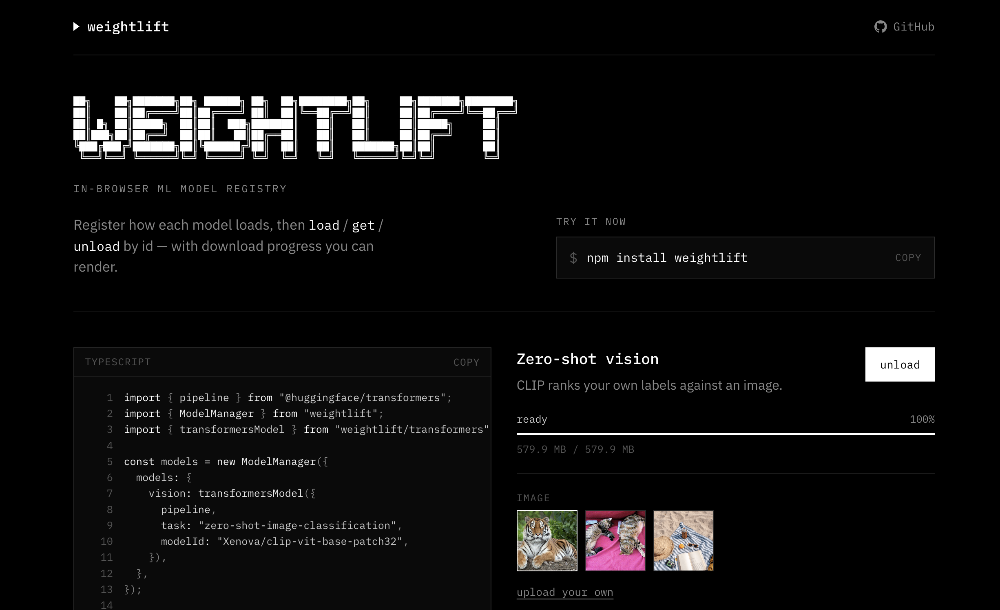

# weightlift

**Build local, on-device AI experiences in the browser — faster.**

Weightlift is a small TypeScript library that handles the hard parts of shipping
in-browser ML: downloading models with real progress, detecting cache hits,
deduping concurrent loads, WebGPU/WASM fallbacks, and clean unload. Point it at
Transformers.js, ONNX, WebLLM, or any custom loader and focus on the product.

[**Try the playground →**](https://weightlift.dev)

[](https://weightlift.dev)

## At a glance

| You get | So you can |
| --- | --- |
| Named multi-model registry | Load, preload, and unload models from one place |
| Download + cache progress | Show “Downloading… 42%” or “Loading from cache…” |
| Concurrent-load deduping | Call `load()` from several places safely |
| `transformersModel` helper | Wire Transformers.js with WebGPU → WASM fallback |
| React hooks | Bind loading UI with `useModel` |
| Worker progress bridge | Keep heavy inference off the main thread |

Runtime-agnostic: Whisper, CLIP, SigLIP, custom ONNX — anything that resolves a
promise and optionally reports byte progress.

## Powered by weightlift

[**rescript**](https://github.com/wassgha/rescript) — open-source, transcript-based
video/audio editor. Drop in a file; Whisper transcription and speaker labels run
fully on-device in the browser. Weightlift manages model download, cache, and
progress for that local AI pipeline.

[Try rescript →](https://wassgha.github.io/rescript/) · [GitHub →](https://github.com/wassgha/rescript)

## Install

```bash
npm install weightlift
```

## Load a model

```ts
import { pipeline } from "@huggingface/transformers";
import { ModelManager } from "weightlift";
import { transformersModel } from "weightlift/transformers";

const models = new ModelManager({
  models: {
    sentiment: transformersModel({
      pipeline,
      task: "sentiment-analysis",
      modelId: "Xenova/distilbert-base-uncased-finetuned-sst-2-english",
    }),
  },
});

const clf = await models.load("sentiment");
await clf("I love transformers!");
// [{ label: "POSITIVE", score: 0.999… }]
```

`transformersModel` picks WebGPU when available (falls back to WASM), wires progress, and detects cache hits.

## Examples

Same patterns as the [playground](https://weightlift.dev).

### Zero-shot vision

```ts
vision: transformersModel({
  pipeline,
  task: "zero-shot-image-classification",
  modelId: "Xenova/clip-vit-base-patch32",
}),

const clip = await models.load("vision");
await clip(imageUrl, ["tiger", "lion", "house cat"]);
```

### Sentiment

```ts
sentiment: transformersModel({
  pipeline,
  task: "sentiment-analysis",
  modelId: "Xenova/distilbert-base-uncased-finetuned-sst-2-english",
}),
```

### Fill-mask

```ts
fillmask: transformersModel({
  pipeline,
  task: "fill-mask",
  modelId: "Xenova/bert-base-uncased",
}),

const unmask = await models.load("fillmask");
await unmask("The browser can run [MASK] models.");
```

### Any other runtime

```ts
custom: {
  load: async ({ progress }) => {
    progress.dispatch({ type: "start" });
    // …fetch / init, dispatch progress events…
    progress.dispatch({ type: "ready" });
    return myModel;
  },
  dispose: (model) => model.destroy?.(),
},
```

## Show progress

```ts
const { status, percent, fromCache } = models.status("sentiment");

const label =
  status === "loading"
    ? fromCache
      ? "Loading from cache…"
      : `Downloading… ${Math.round((percent ?? 0) * 100)}%`
    : "";
```

### React

```tsx
import { useModel } from "weightlift/react";

function LoadButton({ manager }: { manager: ModelManager }) {
  const { percent, fromCache, isLoading, load } = useModel(manager, "sentiment");

  return (
    <button onClick={() => load()} disabled={isLoading}>
      {isLoading
        ? fromCache
          ? "Loading from cache…"
          : `Downloading… ${Math.round((percent ?? 0) * 100)}%`
        : "Load model"}
    </button>
  );
}
```

## Packages

| Import | What |
| --- | --- |
| `weightlift` | `ModelManager`, `Weightlift` |
| `weightlift/react` | `useModel`, `useModelManager`, … |
| `weightlift/worker` | `createWorkerReporter`, `attachWorker` |
| `weightlift/transformers` | `transformersModel`, `fallbackDevicePolicy`, … |

React is an optional peer. `@huggingface/transformers` is not a dependency — pass `pipeline` yourself.

## API

```ts
const models = new ModelManager({ models: { /* … */ } });

await models.load("sentiment");   // dedupes concurrent callers
models.get("sentiment");          // sync access once ready
models.status("sentiment");       // { status, percent, fromCache, … }
await models.unload("sentiment");
await models.preload(["a", "b"]);
```

| Method | Purpose |
| --- | --- |
| `define(id, definition)` | Add or replace a model |
| `remove(id)` | Drop definition and dispose instance |
| `load(id)` | Load (or return in-flight promise) |
| `get(id)` | Sync access to a ready instance |
| `status(id)` | Progress + lifecycle for one model |
| `isReady` / `isLoading` / `has` / `ids` | Queries |
| `unload(id)` / `unloadAll()` | Dispose instances; keep definitions |
| `clear()` | Unload and remove all definitions |
| `preload([ids])` | Warm several models |
| `subscribe` / `getSnapshot` | Subscribe to manager-wide state |

### GPU fallback

```ts
import { fallbackDevicePolicy } from "weightlift/transformers";

fallbackDevicePolicy.preferWasm();
await models.unloadAll();
```

### Workers

```ts
// worker
import { Weightlift } from "weightlift";
import { createWorkerReporter } from "weightlift/worker";

const progress = new Weightlift();
createWorkerReporter(self, progress);

// main
import { attachWorker } from "weightlift/worker";
attachWorker(worker, progress);
```

## Develop

```bash
npm install
npm test
npm run build
npm run demo:dev
```

## License

MIT
